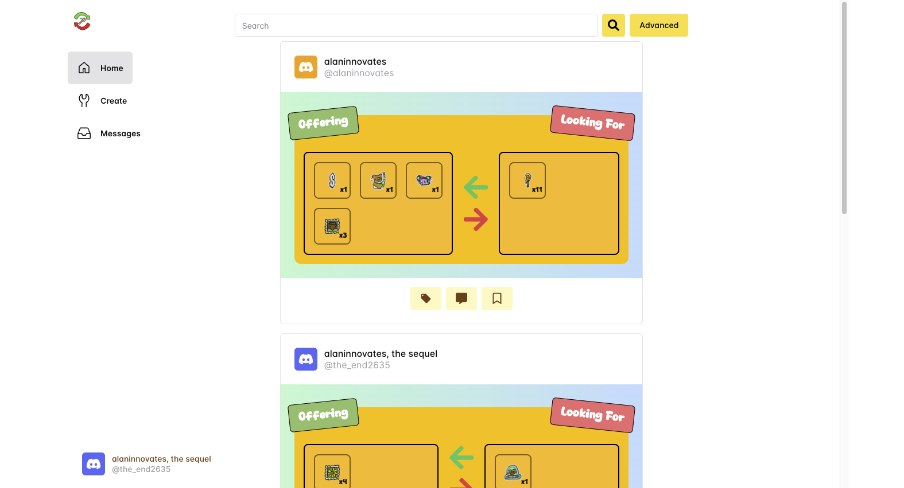
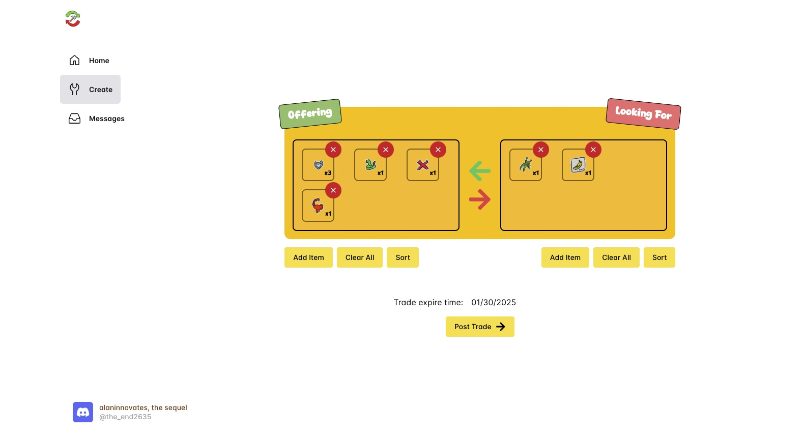
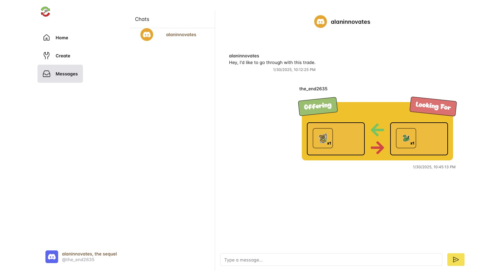
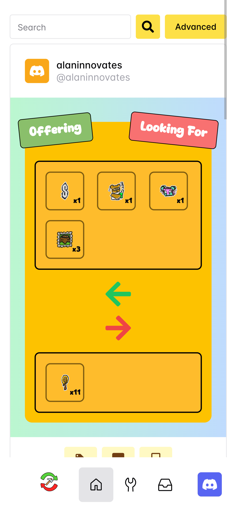

# Trade Builder Website

## What's this?
Trade Builder is a Discord Bot and Website that allows players of the Roblox game [Bee Swarm simulator](https://www.roblox.com/game-details-web-subsite/games/1537690962/Bee-Swarm-Simulator) to publicly advertise and trade their stickers and beequips. The Discord bot can be used as a way to generate beautiful images that can be posted in trading servers, and the website can be used to reach a larger audience. The website also incorporates advanced filtering features, sucha s filtering by items, that would be difficult to do through a trading server.

## Cool, how do I use it?
You can jump right in to the fun at https://tradebuilder.app. Sign in with your Discord account, and start playing around!

A few screenshots of the website in action:
<table>
    <tr>
        <td>
            
            
Home page

        </td>
        <td>
            
            
Trade creator page

        </td>
    </tr>
    <tr>
        <td>
            
            
Messaging page
            
        </td>
    </tr>
</table>

The website is also mobile friendly! Check it out:

## Questions?
Join the [Meta Bee Discord server](https://discord.gg/2BgUMfCsHM) or contact me on Discord at `alaninnovates`!
